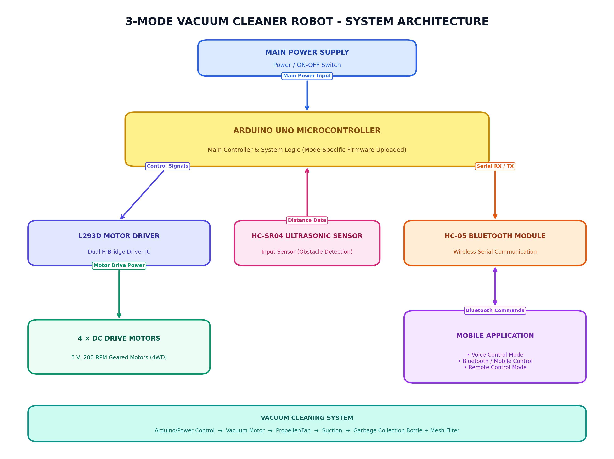
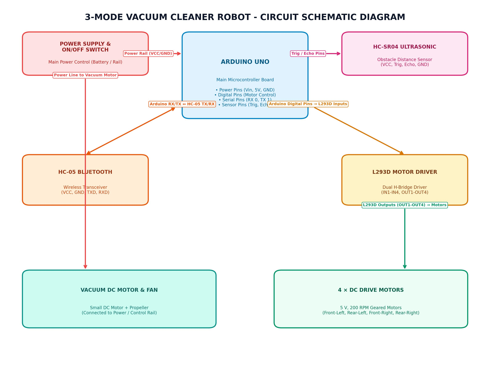
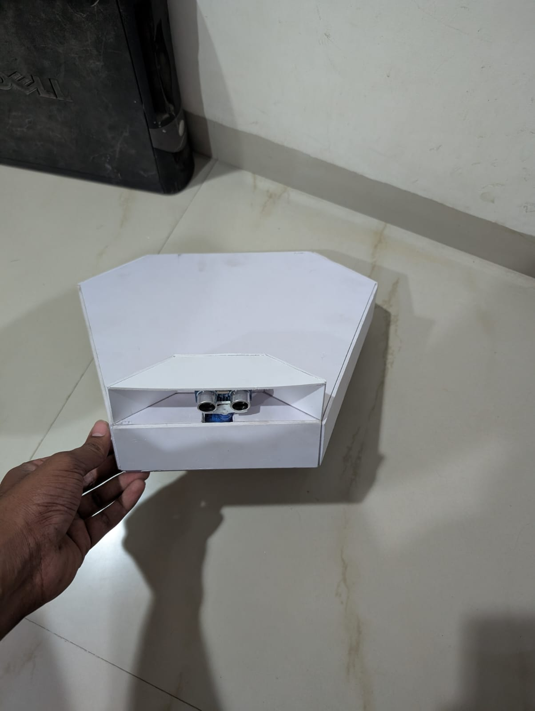
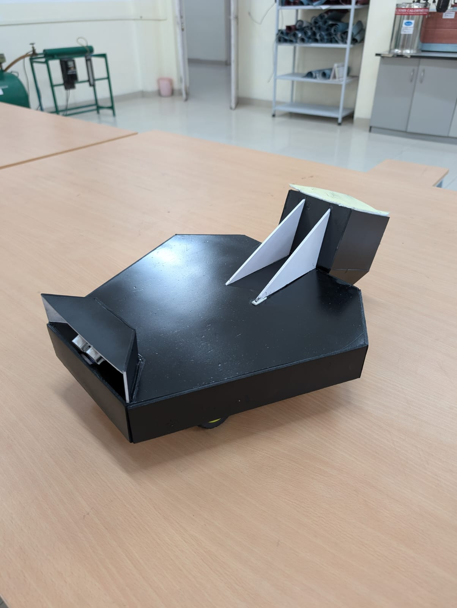
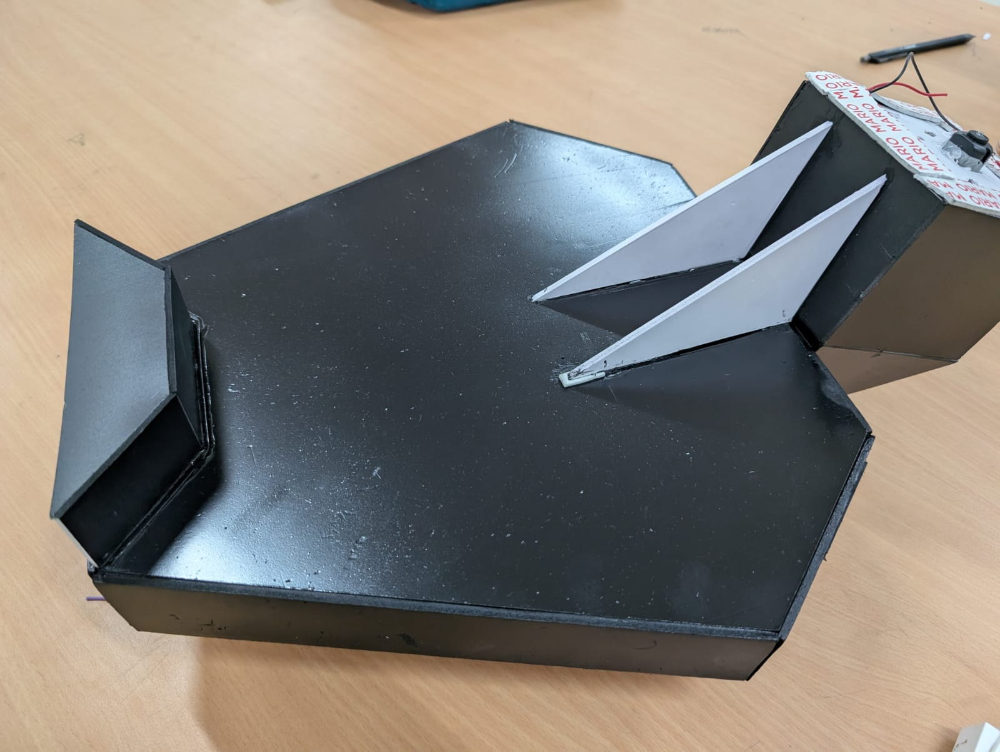
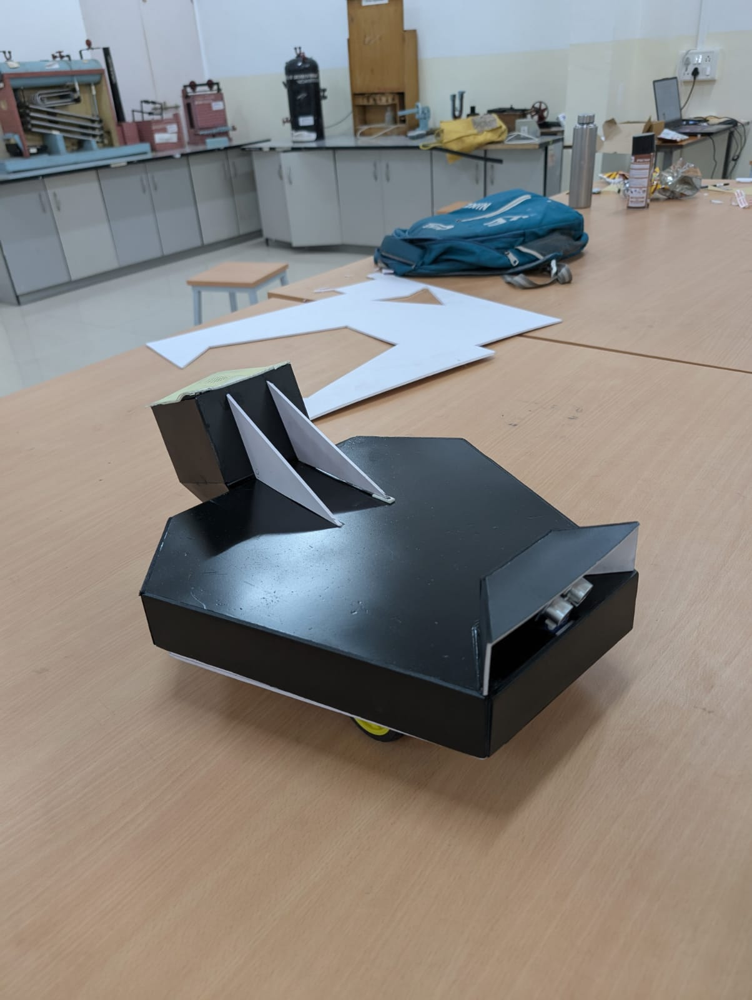
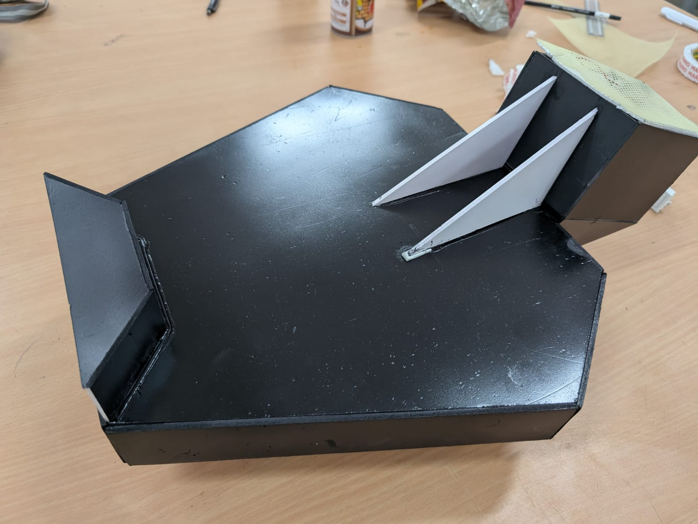
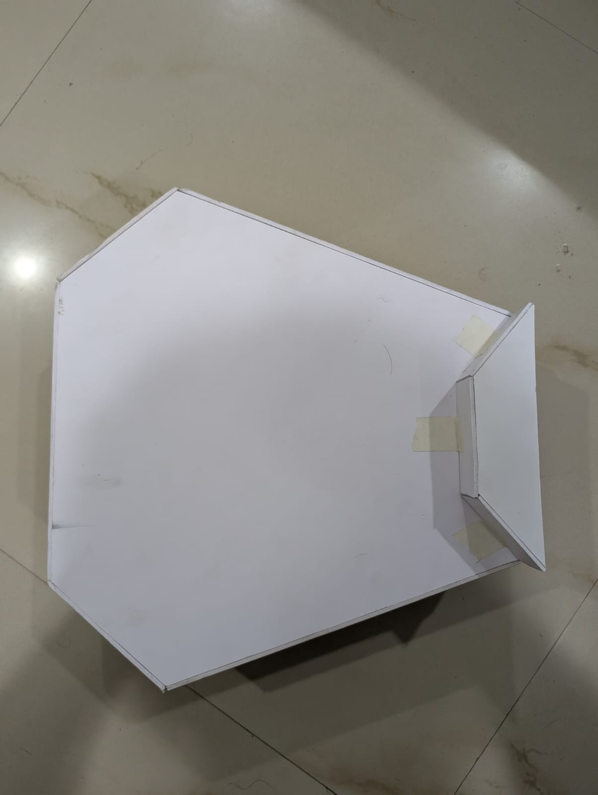

# 3-Mode Vacuum Cleaner Robot (Autonomous, Bluetooth & Voice Control)

An Arduino-based 3-mode robotic vacuum cleaner designed for automated and manual indoor floor cleaning. The project integrates an **Arduino UNO** microcontroller, an **L293D motor driver**, **4 × 5 V, 200 RPM geared DC motors**, an **HC-SR04 ultrasonic obstacle sensor**, an **HC-05 Bluetooth module**, a **foam-sheet body with spray paint finish**, and a **bottle-based vacuum collection system**.

---

## 📖 Project Overview

This project presents a college engineering prototype of a 4-wheel drive (4WD) robotic vacuum cleaner. The robot is designed to perform floor cleaning using three distinct operation modes: **Voice Control Mode**, **Bluetooth / Mobile Control Mode**, and **Remote Control Mode**. Wireless communication between the user's mobile application and the robot is handled via the HC-05 Bluetooth module.

Dust and lightweight floor debris are collected using a custom vacuum mechanism crafted from a modified plastic bottle, a small DC motor with a propeller/fan, and a fine mesh filter.

---

## 🎯 Problem Statement & Objective

Traditional household floor cleaning requires continuous manual effort. While commercial robotic vacuum cleaners exist, they are often expensive, complex, and proprietary. 

This project demonstrates an affordable, modular, open-hardware prototype that:
- Automates basic floor cleaning and obstacle detection.
- Provides versatile user control through smartphone voice commands, touch control, and remote interfaces.
- Utilizes simple, accessible components suitable for academic learning and embedded robotics research.

---

## ✨ Key Features & Operating Modes

### 1. Control Modes
- **Voice Control Mode**: The user speaks voice commands into the mobile application (e.g., "forward", "backward", "left", "right", "stop"). The app converts speech to text and transmits corresponding serial strings wirelessly to the Arduino.
- **Bluetooth / Mobile Control Mode**: The user maneuvers the robot using directional buttons on the mobile application, which transmits single-character serial commands (`'F'`, `'B'`, `'L'`, `'R'`, `'S'`) to steer the 4 DC motors.
- **Remote Control Mode**: The user navigates the robot through a dedicated remote-control interface on the mobile application.

> [!IMPORTANT]
> **Firmware / Code Upload Requirement**:
> Different Arduino programs/codes need to be uploaded to the Arduino UNO depending on the operating mode/function being demonstrated. The robot does **NOT** automatically change its internal Arduino firmware between modes. Before testing or demonstrating a specific mode (e.g., Voice Control vs. Bluetooth Control), the corresponding Arduino sketch must be flashed via the Arduino IDE.

### 2. Physical Construction & Vacuum System
- **4WD Mobility**: Powered by 4 DC geared motors (5 V, 200 RPM) driven via an L293D motor driver.
- **Foam-Sheet Chassis**: Custom body constructed from lightweight foam sheet finished with protective spray paint.
- **Bottle Vacuum System**: A cut and inverted plastic bottle forms a sealed suction chamber where a small DC motor with a rotating propeller creates negative pressure. A mesh filter retains collected garbage inside while allowing exhaust air to exit.
- **Main Power Control**: A master ON/OFF switch controls the power flow to the system.

---

## 🛠️ Hardware Description

| Component | Quantity | Specifications & Technical Description |
| :--- | :---: | :--- |
| **Arduino UNO** | 1 | Main microcontroller board based on ATmega328P. Executes movement algorithms and processes incoming Bluetooth commands. (Requires mode-specific code upload). |
| **L293D Motor Driver** | 1 | Dual H-Bridge motor driver module/IC responsible for driving the 4 DC motors, providing high-current output beyond the Arduino's pin capability. |
| **DC Geared Motors** | 4 | 5 V, 200 RPM DC motors providing smooth 4-wheel drive (4WD) movement for chassis navigation. |
| **HC-05 Bluetooth Module** | 1 | Wireless serial communication module operating at 2.4 GHz (9600 baud) for linking the mobile app to the Arduino. |
| **HC-SR04 Ultrasonic Sensor** | 1 | Input sensor mounted on the front chassis used for detecting obstacles in front of the robot. |
| **Foam-Sheet Robot Body** | 1 | Custom lightweight chassis and structural frame made primarily from foam sheet. |
| **Spray Paint Finish** | As required | Protective and aesthetic spray paint coating applied to the foam-sheet chassis. |
| **Plastic Bottle Vacuum Chamber** | 1 | Modified plastic bottle (cut and inverted) serving as the suction chamber and garbage collection container. |
| **Small DC Motor + Propeller** | 1 | High-speed small DC motor with attached fan/propeller that generates continuous air suction. |
| **Mesh Filter** | 1 | Fine mesh screen placed across the bottle opening allowing air exhaust while retaining garbage inside. |
| **Main ON/OFF Switch** | 1 | Master mechanical power switch controlling the electrical supply to the entire system. |

---

## 📐 System Architecture

The overall system architecture separates main control logic and power management from the physical vacuum suction assembly.

### System Architecture Block Diagram


### Architectural Flow:
```text
Main Power Supply (ON/OFF Switch)
        ↓
Arduino + Motor Control System

Arduino UNO
├── L293D Motor Driver → 4 × 5 V, 200 RPM DC Motors
├── HC-SR04 Ultrasonic Sensor → Obstacle Detection (Input)
└── HC-05 Bluetooth Module ↔ Mobile Application

Mobile Application Interface:
├── Voice Control
├── Bluetooth / Mobile Control
└── Remote Control

Vacuum Cleaning Mechanism (Separate Assembly):
Power / Control → Small DC Motor → Propeller/Fan → Air & Debris Suction → Plastic Bottle → Mesh Filter
```

---

## 🔌 Circuit Schematic Diagram

The circuit diagram illustrates the electrical interconnection between the Arduino UNO controller, L293D driver, motors, sensors, Bluetooth module, power switch, and vacuum motor.

### Circuit Diagram


### Interconnection Summary:
- **Power Connection**: The Main ON/OFF switch connects the primary power source to the Arduino Vin pin, L293D VCC, and vacuum motor circuit.
- **L293D Motor Driver**:
  - Connected to Arduino digital pins for directional input signals (`IN1`, `IN2`, `IN3`, `IN4`).
  - Motor outputs (`OUT1`–`OUT4`) connect to the four 5 V, 200 RPM DC drive motors (front-left, rear-left, front-right, rear-right).
- **HC-05 Bluetooth Module**:
  - Connected to Arduino serial hardware/software pins (`TX` to Arduino `RX`, `RX` to Arduino `TX`).
  - Powered via Arduino 5 V and GND rails.
- **HC-SR04 Ultrasonic Sensor**:
  - Connected to Arduino pins for `Trig` (trigger pulse) and `Echo` (echo return).
  - Powered via Arduino 5 V and GND rails.
- **Vacuum Motor**:
  - Connected across the power/control line to drive the suction propeller continuously during operation.

---

## 🌀 Vacuum Mechanism Details

The suction system is built using a simple, effective DIY approach:

### Working of the Vacuum Chamber:
1. **Chamber Structure**: A standard plastic bottle is cut and inverted to form a tapered suction chamber.
2. **Propeller Fan Assembly**: A small high-RPM DC motor equipped with a propeller/fan is mounted at the narrow outlet end of the bottle.
3. **Suction Generation**: When powered, the rotating propeller forces air out of the rear, creating low pressure (vacuum) inside the bottle.
4. **Debris Intake**: Atmospheric pressure forces outside air and floor dust/garbage into the front bottle inlet.
5. **Garbage Retention**: A fine mesh filter screen spans the bottle section. Air passes freely through the mesh, while collected dust and garbage remain trapped inside the bottle chamber.

---

## ⚡ Step-by-Step Working Principle

1. **Power On**: The user turns the robot ON using the main ON/OFF switch.
2. **System Initialization**: The Arduino initializes input/output pins, serial communication with the HC-05 module, and sensor routines.
3. **Control Mode Selection**: The user selects the desired operating mode (Voice Control, Bluetooth Control, or Remote Control) in the smartphone mobile application.
4. **Command Transmission**: The mobile application sends wireless control commands via Bluetooth to the HC-05 module connected to the Arduino.
5. **Signal Processing**: The Arduino receives and decodes the commands, translating them into motor movement instructions.
6. **Motor Drive Execution**: Arduino sends control signals to the L293D motor driver.
7. **4WD Chassis Movement**: The L293D drives the four 5 V, 200 RPM DC motors to move forward, backward, left, right, or stop.
8. **Obstacle Detection**: The HC-SR04 ultrasonic sensor continuously scans for obstacles in front of the robot to prevent collisions.
9. **Suction Generation**: The small DC motor and propeller rotate to pull air and floor debris into the plastic bottle inlet.
10. **Debris Filtration & Retention**: The mesh filter traps collected garbage inside the bottle while allowing exhaust air to exit freely.

---

## 🖼️ Prototype Gallery

| Sensor & Front View | Chassis Side Profile | Vacuum Suction Chamber |
| :---: | :---: | :---: |
|  |  |  |

| Perspective View | Top Front View | Chassis Structure |
| :---: | :---: | :---: |
|  |  |  |

### Demonstration Videos
Demonstration video clips of the physical prototype are stored in the [`video/`](video/) folder:
- [`video/robot_demo_full.mp4`](video/robot_demo_full.mp4) - Complete operational demonstration
- [`video/robot_demo_short.mp4`](video/robot_demo_short.mp4) - Functional highlights

---

## 💻 Firmware Setup & Code Upload

### Prerequisites
- **Arduino IDE** (v1.8.x or v2.x)
- Arduino board package for `Arduino Uno`
- Standard `AFMotor.h` library for L293D motor driver support

### Upload Procedure:
1. Open the Arduino project file [`code/vaccum.ino`](code/vaccum.ino) in the Arduino IDE.
2. Select **Board**: `Arduino Uno` and choose the corresponding serial **COM Port**.
3. **Select Operating Mode in Code**:
   In `loop()`, uncomment the function corresponding to the specific demonstration mode required, while keeping other mode calls commented out:
   ```cpp
   void loop() {
     // Obstacle();           // Enable for Autonomous Obstacle Avoidance Mode
     Bluetoothcontrol();      // Enable for Mobile App Bluetooth Control Mode
     // voicecontrol();       // Enable for Voice Command Control Mode
   }
   ```
4. **Disconnect Bluetooth Pins During Upload**:
   Disconnect the HC-05 `TX`/`RX` jumper wires from Arduino pins `0` and `1` before clicking **Upload** (to prevent serial conflict with USB flashing).
5. Click **Upload**. Reconnect the HC-05 module once uploading completes.

---

## 📁 Repository Structure

```text
.
├── README.md                                          # Master documentation file
├── generate_diagrams.py                              # Python script for generating diagrams
├── architecture/
│   └── block_diagram.jpg                             # Clean system architecture block diagram
├── circuit/
│   └── circuit_diagram.jpg                           # Clean circuit schematic block diagram
├── code/
│   └── vaccum.ino                                    # Arduino UNO firmware source code
├── photos/
│   ├── chassis_structure_view.jpg                    # Base chassis structural photo
│   ├── power_switch_assembly.jpg                     # Power switch detail photo
│   ├── robot_perspective_view.jpg                    # Complete robot perspective photo
│   ├── robot_side_profile.jpg                        # Side profile photo
│   ├── robot_top_front_view.jpg                      # Top-front view photo
│   ├── suction_chamber_top_view.jpg                  # Suction fan & dust collector photo
│   └── ultrasonic_sensor_mount.jpg                   # Front ultrasonic sensor mount photo
└── video/
    ├── robot_demo_full.mp4                           # Full project video demonstration
    └── robot_demo_short.mp4                          # Short video clip
```
